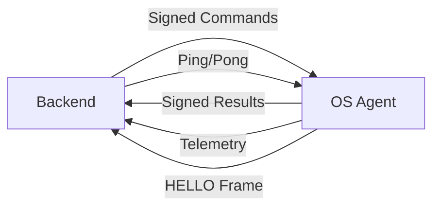

# 🚀 ViWorks OS Agent - Outbound Connection System

## **📋 Overview**

The ViWorks OS Agent now supports **outbound-only communication** with your backend, eliminating inbound exposure on the Gateway OS. This provides a secure, persistent connection channel for command execution and telemetry.

## **🔒 Security Features**

### **Multi-Layer Security**
- **mTLS Authentication**: Client certificates for agent identity
- **SPKI Pinning**: Certificate pinning to prevent MITM attacks
- **Nonce Protection**: Replay attack prevention
- **Command Allowlist**: Only predefined commands allowed
- **Schema Validation**: Strict parameter validation
- **Rate Limiting**: Per-client request throttling
- **Timeout Controls**: Command execution timeouts
- **Concurrency Limits**: Resource exhaustion protection

### **Connection Security**
- **Outbound-Only**: No inbound ports exposed
- **Persistent WebSocket**: Always-on connection
- **Automatic Reconnection**: Exponential backoff with jitter
- **Heartbeat Monitoring**: Connection health checks

## **🏗️ Architecture**



### **Connection Flow**
1. **Bootstrap**: Agent loads config and validates certificates
2. **Connect**: Establishes mTLS WebSocket to backend
3. **Register**: Sends HELLO frame with capabilities
4. **Keepalive**: Heartbeat every 15 seconds
5. **Commands**: Receives and executes signed commands
6. **Telemetry**: Pushes system health every 30 seconds

## **⚙️ Configuration**

### **Environment Variables**

```bash
# Backend Connection
export VIW_AGENT_BACKEND_URL="wss://backend.example.com/agent"
export VIW_AGENT_ID="gateway-001"
export VIW_AGENT_SITE="production"

# mTLS Certificates
export VIW_AGENT_CERT_PATH="/etc/viworks-agent/client.crt"
export VIW_AGENT_KEY_PATH="/etc/viworks-agent/client.key"
export VIW_AGENT_TRUST_BUNDLE="/etc/viworks-agent/ca.crt"
export VIW_AGENT_BACKEND_SPKI_PIN="your-spki-pin-here"

# Feature Flags
export VIW_AGENT_FEATURE_INBOUND_HTTP="false"
export VIW_AGENT_FEATURE_EXEC_ENABLE="true"

# Execution Settings
export VIW_AGENT_SCRIPTS_ROOT="/opt/Viworks/scripts_viworks"
export VIW_AGENT_MAX_CONCURRENCY="4"
export VIW_AGENT_CMD_TIMEOUT_SECS="45"

# Container Engine
export VIW_AGENT_CONTAINER_ENGINE="docker"
```

### **Configuration File**

```toml
[outbound]
backend_url = "wss://backend.example.com/agent"
agent_id = "gateway-001"
site = "production"
cert_path = "/etc/viworks-agent/client.crt"
key_path = "/etc/viworks-agent/client.key"
trust_bundle = "/etc/viworks-agent/ca.crt"
backend_spki_pin = "your-backend-spki-pin-here"
feature_inbound_http = false
feature_exec_enable = true
scripts_root = "/opt/Viworks/scripts_viworks"
max_concurrency = 4
cmd_timeout_secs = 45
container_engine = "docker"
```

## **🔧 Setup Instructions**

### **1. Generate Client Certificates**

```bash
# Create certificate directory
sudo mkdir -p /etc/viworks-agent
sudo chown viworks:viworks /etc/viworks-agent
sudo chmod 750 /etc/viworks-agent

# Generate client certificate (example with OpenSSL)
openssl req -new -newkey rsa:2048 -keyout client.key -out client.csr
openssl x509 -req -in client.csr -CA ca.crt -CAkey ca.key -CAcreateserial -out client.crt -days 365

# Copy certificates
sudo cp client.crt /etc/viworks-agent/
sudo cp client.key /etc/viworks-agent/
sudo cp ca.crt /etc/viworks-agent/

# Set permissions
sudo chown viworks:viworks /etc/viworks-agent/*
sudo chmod 600 /etc/viworks-agent/client.key
sudo chmod 644 /etc/viworks-agent/client.crt
sudo chmod 644 /etc/viworks-agent/ca.crt
```

### **2. Get Backend SPKI Pin**

```bash
# Extract SPKI from backend certificate
openssl x509 -in backend.crt -pubkey -noout | \
openssl pkey -pubin -outform DER | \
openssl dgst -sha256 -binary | \
base64
```

### **3. Configure Environment**

```bash
# Set environment variables
export VIW_AGENT_BACKEND_URL="wss://your-backend.com/agent"
export VIW_AGENT_BACKEND_SPKI_PIN="your-spki-pin-here"
export VIW_AGENT_FEATURE_INBOUND_HTTP="false"

# Or use configuration file
cp agent-outbound.toml agent.toml
# Edit agent.toml with your values
```

### **4. Start Agent**

```bash
# Start with outbound-only mode
cargo run

# Or build and run
cargo build --release
./target/release/viworks-gateway-agent
```

## **📡 Available Commands**

### **User Management**
- `create_panel_user` - Create panel user account
- `create_openvpn_user` - Create VPN user account
- `delete_user` - Remove user completely
- `list_users` - List all users

### **Session Management**
- `spawn_container` - Create user session container
- `stop_container` - Stop specific container
- `terminate_session` - End user session
- `list_containers` - List active containers
- `get_session_status` - Check session health

### **System Monitoring**
- `get_system_health` - System performance metrics
- `get_service_status` - Service health status
- `get_monitoring_data` - Comprehensive system data

### **Security**
- `generate_bootstrap` - Create temporary access token
- `revoke_bootstrap` - Invalidate access token

## **🔍 Command Schema Validation**

### **Example: Create Panel User**
```json
{
  "type": "COMMAND",
  "payload": {
    "corr_id": "uuid-here",
    "verb": "create_panel_user",
    "args": {
      "username": "user123",
      "password": "securepass123"
    },
    "actor": {
      "id": "admin-001",
      "role": "ADMIN"
    },
    "policy_id": "policy-2025-01",
    "nonce": "unique-nonce-here",
    "iat": 1704067200,
    "exp": 1704067260,
    "agent_targets": ["gateway-001"]
  }
}
```

### **Validation Rules**
- **Username**: 3-64 characters, alphanumeric + underscore + hyphen
- **Password**: 8-128 characters
- **Timeout**: 60-86400 seconds for VPN users
- **No Extra Keys**: Rejects unexpected parameters

## **📊 Telemetry & Monitoring**

### **System Health (Every 30s)**
```json
{
  "type": "TELEMETRY",
  "payload": {
    "agent_id": "gateway-001",
    "site": "production",
    "ts": "2025-01-01T00:00:00Z",
    "uptime_s": 3600,
    "cpu_pct": 23.4,
    "mem": {
      "total_mb": 2048,
      "used_mb": 512
    },
    "loadavg": [0.35, 0.40, 0.60],
    "disk": [{"mount": "/", "used_pct": 62.1}],
    "services": {
      "openvpn": "active",
      "nginx": "active"
    },
    "containers": {
      "running": 3,
      "images": [{"image": "chrome-sandbox:latest", "count": 3}]
    }
  }
}
```

### **Event Notifications**
- Container spawn/stop events
- User creation/deletion events
- Service status changes
- Security events

## **🚨 Error Handling**

### **Error Types**
- `SCRIPT_NOT_FOUND` - Required script missing
- `VALIDATION_FAILED` - Parameter validation failed
- `EXEC_TIMEOUT` - Command execution timeout
- `RATE_LIMITED` - Too many requests
- `INVALID_SIGNATURE` - Authentication failed
- `EXPIRED_TOKEN` - Command expired
- `REPLAY_DETECTED` - Nonce reuse detected
- `UNKNOWN_VERB` - Command not allowed
- `SCHEMA_MISMATCH` - Invalid parameters

### **Error Response**
```json
{
  "type": "RESULT",
  "payload": {
    "corr_id": "uuid-here",
    "agent_id": "gateway-001",
    "verb": "create_panel_user",
    "status": "DENIED",
    "rc": -1,
    "duration_ms": 0,
    "stdout": "",
    "stderr_hash": "sha256-hash-here",
    "error_code": "VALIDATION_FAILED",
    "ts": "2025-01-01T00:00:00Z"
  }
}
```

## **🔧 Troubleshooting**

### **Connection Issues**
```bash
# Check certificate permissions
ls -la /etc/viworks-agent/

# Verify certificate validity
openssl x509 -in /etc/viworks-agent/client.crt -text -noout

# Test WebSocket connection
wscat -c wss://backend.example.com/agent
```

### **Command Execution Issues**
```bash
# Check script permissions
ls -la /opt/Viworks/scripts_viworks/

# Test script manually
sudo -u viworks /opt/Viworks/scripts_viworks/add_user.sh testuser testpass

# Check agent logs
journalctl -u viworks-gateway-agent -f
```

### **Common Problems**

#### **1. Certificate Errors**
```
Error: Client certificate not found
Solution: Check cert_path and permissions
```

#### **2. SPKI Pin Mismatch**
```
Error: SPKI pin validation failed
Solution: Update VIW_AGENT_BACKEND_SPKI_PIN
```

#### **3. Script Execution Failed**
```
Error: Script failed: Permission denied
Solution: Check script permissions and sudoers
```

#### **4. Connection Timeout**
```
Error: WebSocket connection failed
Solution: Check backend URL and firewall rules
```

## **📈 Performance Tuning**

### **Concurrency Settings**
```toml
max_concurrency = 4        # Adjust based on CPU cores
cmd_timeout_secs = 45      # Increase for complex operations
```

### **Telemetry Intervals**
```toml
collect_interval = 30      # System health every 30s
retention_days = 30        # Log retention period
```

### **Resource Limits**
```toml
memory_limit = "512m"      # Container memory limit
cpu_limit = "0.5"          # Container CPU limit
```

## **🔐 Security Best Practices**

### **1. Certificate Management**
- Use short-lived client certificates (≤30 days)
- Implement automatic certificate rotation
- Store private keys securely (600 permissions)
- Use strong key algorithms (RSA 2048+ or Ed25519)

### **2. Network Security**
- Use dedicated network for agent-backend communication
- Implement network segmentation
- Monitor for unusual connection patterns
- Use firewall rules to restrict outbound connections

### **3. Access Control**
- Implement least-privilege for scripts
- Use sudoers with exact command allowlist
- Audit all command executions
- Monitor for privilege escalation attempts

### **4. Monitoring & Alerting**
- Set up alerts for connection failures
- Monitor certificate expiration
- Track command execution patterns
- Alert on security violations

## **🚀 Migration Guide**

### **From HTTP to Outbound-Only**

#### **Phase 1: Parallel Operation**
```toml
feature_inbound_http = true   # Keep HTTP endpoints
feature_exec_enable = true    # Enable outbound commands
```

#### **Phase 2: Cutover**
```toml
feature_inbound_http = false  # Disable HTTP endpoints
feature_exec_enable = true    # Full outbound operation
```

#### **Phase 3: Cleanup**
- Remove HTTP endpoint code
- Update firewall rules
- Remove inbound port exposure

### **Backend Integration**

#### **1. WebSocket Endpoint**
```rust
// Backend WebSocket handler
async fn agent_websocket(ws: WebSocket) {
    // Handle agent connections
    // Send signed commands
    // Receive telemetry data
}
```

#### **2. Command Signing**
```rust
// Sign commands with backend private key
let command = CommandEnvelope::new(verb, args, actor, policy_id, targets);
let signed_command = sign_command(command, backend_private_key);
```

#### **3. Result Validation**
```rust
// Validate agent responses
let result = validate_result(result_envelope, agent_public_key);
```

## **📚 API Reference**

### **WebSocket Messages**

#### **HELLO Frame**
```json
{
  "type": "HELLO",
  "payload": {
    "agent_id": "gateway-001",
    "site": "production",
    "agent_version": "0.1.0",
    "os": "linux",
    "kernel": "5.15.0",
    "container_engine": "docker",
    "supported_verbs": ["create_panel_user", "..."],
    "start_time": "2025-01-01T00:00:00Z",
    "feature_flags": {
      "exec_enable": true,
      "inbound_http": false
    }
  }
}
```

#### **Ping/Pong**
```json
{"type": "PING", "data": "base64-data"}
{"type": "PONG", "data": "base64-data"}
```

### **Command Execution Flow**

1. **Backend** → **Agent**: Send signed command envelope
2. **Agent**: Validate signature, nonce, and schema
3. **Agent**: Execute command with timeout and sandboxing
4. **Agent** → **Backend**: Send signed result envelope
5. **Backend**: Validate result and update state

## **🎯 Next Steps**

### **Immediate Actions**
1. ✅ **Implement outbound connection system**
2. ✅ **Add command schema validation**
3. ✅ **Create secure command executor**
4. ✅ **Add telemetry and monitoring**

### **Future Enhancements**
1. 🔄 **Add JWS signature validation**
2. 🔄 **Implement certificate rotation**
3. 🔄 **Add advanced monitoring dashboards**
4. 🔄 **Create automated testing suite**

---

**Document Version**: 1.0  
**Last Updated**: 2025-01-01  
**Status**: ✅ **Implementation Complete**  
**Next Review**: 2025-02-01
